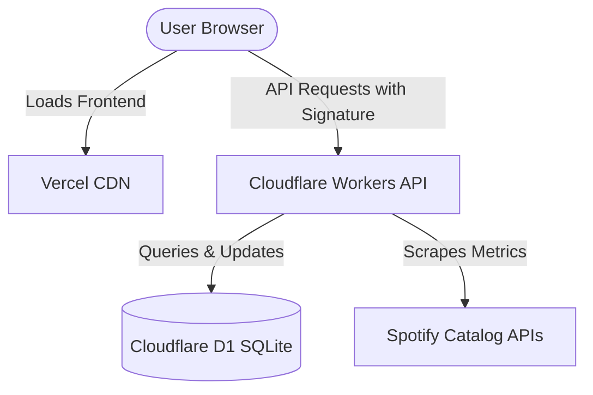

# 🌶️ Spicy Monitor (Spicy Stats)

[](https://github.com/Sppqq/spicy-stats/actions/workflows/deploy-cloudflare.yml)
[](https://vercel.com)
[](https://workers.cloudflare.com)
[](https://developers.cloudflare.com/d1/)

**Spicy Monitor** is a modern, real-time performance tracking and audience growth analytics platform tailored for Spotify creators, audio catalogs, and music track statistics. Built with an ultra-lightweight, high-performance architecture, it delivers lightning-fast insights using native Web technologies.

---

## ✨ Features

- **📊 Comprehensive Dashboards**: Track listeners, daily streams, follower count, and catalog performance over custom time intervals.
- **🔄 Smart Track Variant Grouping**: Deduplicates and groups identical tracks featuring different artist configurations (e.g., solos, collaborations, or re-releases) into clean variants.
- **🛡️ Secure APIs**: Features robust IP-based rate limiting and request signature verification to prevent spam and unauthorized scraping.
- **🎨 Interactive UI Themes**: Dynamic and responsive user interfaces featuring sleek dark, neo-brutalism, and code-terminal themes with smooth transitions.
- **📲 Progressive Web App (PWA)**: Built-in service worker (`sw.js`) supporting persistent local caching and offline capabilities.
- **📤 Data Portability**: Full JSON-based catalog export and import functionalities for easy backups and database migrations.

---

## 🏛️ Architecture & Tech Stack

Spicy Monitor uses a clean, decoupled frontend-backend architecture designed for maximum performance, minimal bundle sizes, and zero cold starts.



### Frontend (SPA)
- **Core**: Vanilla HTML5, ES6+ JavaScript.
- **Styling**: Modern, premium CSS (HSL theme variables, glassmorphism, responsive grid layouts).
- **Hosting**: Hosted on **Vercel** with clean route rewriting (`vercel.json`).
- **Analytics**: Integrated with Vercel Web Analytics and Speed Insights.

### Backend (API & Worker)
- **Serverless**: **Cloudflare Workers** handles request processing, API routing, and cron-scheduled catalog scrapers.
- **Database**: **Cloudflare D1** (serverless SQL database built on SQLite) stores users, track metadata, snapshots, and security audit logs.
- **Security**: HMACS-like signature checks (`X-Spicy-Signature` + `X-Spicy-Timestamp`) validate client-side authenticity.

---

## 📁 Repository Structure

```
├── .github/workflows/          # CI/CD Workflows
│   └── deploy-cloudflare.yml   # Auto-deploys worker on commits to main
├── cloudflare_pages/           # Cloudflare Worker Directory
│   ├── worker.js               # Cloudflare Worker entrypoint (Router, Scraping, DB prepared statements)
│   ├── wrangler.toml           # Wrangler configuration (database bindings, logs observability)
│   └── package.json            # Dev dependencies & scripts
├── admin.html                  # Admin Control Center (add creators, import/export catalogs, check audits)
├── dashboard.html              # Main Analytics Dashboard (catalog metrics, charts, tables)
├── user.html                   # Individual Creator Performance Views
├── sw.js                       # Service Worker for local caching
├── vercel.json                 # Vercel SPA routing/rewriting rules
└── .gitignore                  # Git exclusions
```

---

## 🚀 Getting Started

### 1. Backend Setup (Cloudflare Workers + D1)

To run or deploy the Cloudflare Workers backend, navigate to the `cloudflare_pages` directory:

```bash
cd cloudflare_pages
npm install
```

#### Run Database Migrations
Initialize your D1 database locally or on Cloudflare:
```bash
# Local development DB initialization
npx wrangler d1 execute spicy-stats-db --local --file=./migrations/schema.sql

# Production DB initialization
npx wrangler d1 execute spicy-stats-db --remote --file=./migrations/schema.sql
```
*(Ensure database schema exists or let the worker auto-initialize it using the fallback schema creation scripts embedded within `worker.js`).*

#### Local Backend Development
```bash
npm run dev
```

#### Deploy Backend
```bash
npx wrangler deploy
```

### 2. Frontend Setup (Vercel / Local Server)

Since the frontend is built entirely using standard HTML/CSS/JS, you can serve it with any local web server or deploy it to Vercel instantly.

#### Local Frontend Development
Run using Python:
```bash
py -m http.server 3000
```
Or Node.js:
```bash
npx serve -l 3000
```

Access the application at:
- Dashboard: `http://localhost:3000/dashboard.html`
- User page: `http://localhost:3000/user.html?username=creator_name`
- Admin page: `http://localhost:3000/admin.html`

---

## 🔒 Security

All API endpoints (except public reads and data imports) are signed with a timestamped hashing scheme to prevent malicious payloads:
- Requests require `X-Spicy-Signature` and `X-Spicy-Timestamp`.
- A 90-second drift window is strictly enforced.
- Critical actions write records directly to the `audit_logs` database table.

---

## 📄 License

This project is proprietary and maintained by the Spicy Stats development team.
