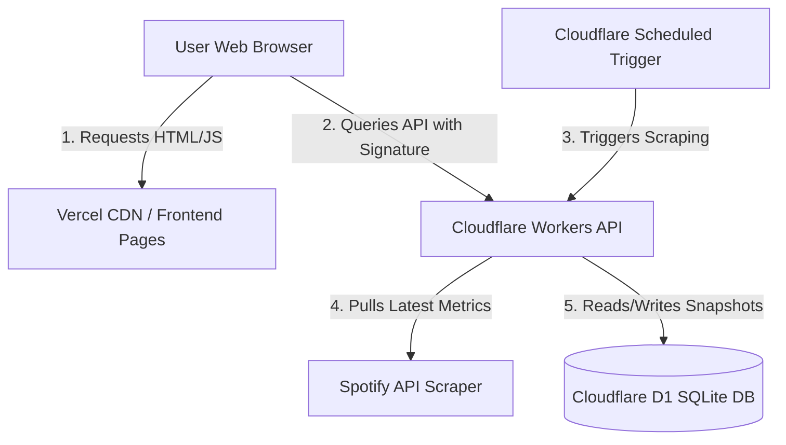

# 🌶️ Spicy Monitor (Spicy Stats)

[](https://github.com/Sppqq/spicy-stats/actions/workflows/deploy-cloudflare.yml)
[](https://vercel.com)
[](https://workers.cloudflare.com)
[](https://developers.cloudflare.com/d1/)

**Spicy Monitor** is an enterprise-grade, real-time catalog tracker, stats dashboard, and audience growth analytics system designed specifically for Spotify creators, audio catalogs, and track statistics. Built with a decoupled architecture, it offers serverless execution with instant load times and zero cold starts.

---

## 🏛️ Architecture & System Design

Spicy Monitor is divided into two primary systems:
1. **Frontend SPA**: A multi-themed static single-page application hosted on **Vercel** with full client caching.
2. **Backend API Worker**: A **Cloudflare Worker** paired with a **Cloudflare D1 SQLite Database** that scrapes Spotify catalogs, runs analytics, and handles authentication.



---

## ✨ Core Features

- **📊 Comprehensive Dashboards**: Visualizes daily plays, growth differentials, milestones, and catalog sizes.
- **🔄 Intelligent Track Grouping**: Automatically identifies identical music tracks featuring different artist lists (e.g. single releases vs. collaborative albums) and aggregates them as variants under a single track entity.
- **🛡️ Signed API Handshake**: Crucial write actions and analytical profiles are secured using timestamped client-side hashing (`X-Spicy-Signature`) to block unauthorized web scraping.
- **🎨 Dynamic Themes**: Toggle dynamically between three custom themes:
  - **Neon Dark**: Default high-contrast dark palette with deep violets and greens.
  - **Neo-Brutalism**: Vibrant borders, stark typography, and flat color design.
  - **Terminal / Retro**: Monospaced hacker green aesthetic.
- **📈 Progressive Web App (PWA)**: Built-in offline-ready Service Worker (`sw.js`) that caches frontend pages, static resources, and external typography fonts.
- **🔄 Catalog Migration Tools**: Comprehensive JSON-based catalog backup/restore triggers.

---

## 🗄️ Database Schema (Cloudflare D1 SQLite)

Spicy Monitor uses a structured SQLite relational schema in Cloudflare D1.

| Table Name | Primary Key | Description |
| :--- | :--- | :--- |
| **`users`** | `id` (INTEGER) | Stores tracked Spotify creators. Includes Discord integrations (`discord_id`, `discord_avatar`). |
| **`snapshots`** | `id` (INTEGER) | Stores daily/hourly statistics checkpoints containing `total_views` (total streams) and `total_songs`. |
| **`snapshot_songs`** | `(snapshot_id, spotify_id)` | Maps track plays inside a specific snapshot. Contains `views` (play count), `title`, and `artist`. |
| **`track_metadata`** | `spotify_id` (TEXT) | Global cache mapping Spotify IDs to ISRCs, clean titles, and normalized artists to assist deduplication. |
| **`audit_logs`** | `id` (INTEGER) | Secure logging of administrative and analytical operations, logging IP addresses and action types. |

---

## 🔌 API Route Directory

All backend routes are prefixed with `/api`. Public endpoints require a valid signature header to prevent unauthorized access.

### Public Routes (Requires Signature Validation)

> [!NOTE]
> All public API endpoints require `X-Spicy-Signature` and `X-Spicy-Timestamp` headers generated with a shared salt to block unauthorized scrapers.

- **`GET /api/dashboard`**: Fetch aggregate stats (total users, global plays, full creator leaderboard).
- **`GET /api/user/:username`**: Fetch creator-specific analytics including historical growth charts, milestone forecasts, top tracks, and grouped variants.
- **`GET /api/track-history`**: Fetch historical play count logs for a specific track.
- **`POST /api/add-user`**: Add a new Spotify username to the monitoring system. *(Strictly rate-limited to 5 requests/min per IP)*.

### Administrative Routes (Requires Admin Credentials)

- **`POST /api/admin/stats`**: Aggregated system database health checks.
- **`POST /api/admin/scrape-user`**: Instantly force-scrape a creator's catalog.
- **`POST /api/admin/scrape-all`**: Trigger a complete catalog scrape across all users.
- **`POST /api/admin/populate-metadata`**: Backfill missing track metadata and ISRCs.
- **`POST /api/admin/merge-users`**: Merge duplicate user entities and consolidate history.
- **`POST /api/admin/delete-user`**: Permanently remove a creator and all associated statistical snapshots.
- **`POST /api/admin/logs`**: Review administrative audit trails.

### Migration Routes

- **`POST /api/import`**: Bulk-restore snapshots and user data.
- **`GET /api/export/:username`**: Download a clean JSON database dump of a creator's tracking history.

---

## 🛠️ Track Variant Grouping Algorithm

To prevent Spotify duplicates (e.g. tracks on both a Deluxe Album and a Collaboration Single) from cluttering the graphs, Spicy Monitor utilizes a custom grouping system:

1. **Title Normalization**: Standardizes title suffixes (removes brackets like `(Remastered)`, `- Single Version`, `(feat. ...)`).
2. **Collaboration Matching**: Matches primary artists and analyzes track ISRCs.
3. **Variants Aggregation**: Groups duplicates as variants under a master track, combining total plays while allowing users to inspect individual track codes.

---

## 🚀 Getting Started

### 1. Backend Setup

```bash
cd cloudflare_pages
npm install
```

#### Database Setup
Create and configure your Cloudflare D1 database:
```bash
# Create database
npx wrangler d1 create spicy-stats-db

# Run migrations locally
npx wrangler d1 execute spicy-stats-db --local --file=./migrations/schema.sql

# Run migrations in production
npx wrangler d1 execute spicy-stats-db --remote --file=./migrations/schema.sql
```

Add your database ID and name to `wrangler.toml`:
```toml
[[d1_databases]]
binding = "DB"
database_name = "spicy-stats-db"
database_id = "your-d1-database-id-here"
```

#### Run Locally
```bash
npm run dev
```

#### Deploy Backend
```bash
npx wrangler deploy
```

---

### 2. Frontend Setup

The frontend runs on plain HTML/CSS/JS. Set your API URL mapping in the client configuration, then serve or deploy:

```bash
# Start a simple web server locally
py -m http.server 3000
```
Open `http://localhost:3000` to access the application.

---

## 📄 License

This repository is proprietary. Unauthorized redistribution or scraping is strictly prohibited.
