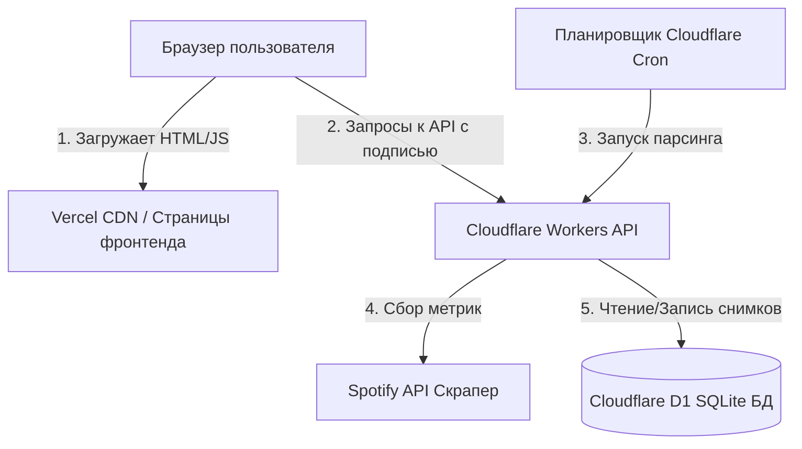

# 🌶️ Spicy Monitor (Spicy Stats) — Русский

[](https://github.com/Sppqq/spicy-stats/actions/workflows/deploy-cloudflare.yml)
[](https://vercel.com)
[](https://workers.cloudflare.com)
[](https://developers.cloudflare.com/d1/)

[English version of README is available here](./README.md).

**Spicy Monitor** — это высокопроизводительная система мониторинга каталогов, панель статистики и аналитики роста аудитории для создателей контента в Spotify, музыкальных каталогов и статистики треков. Построена на раздельной (decoupled) архитектуре с использованием бессерверных технологий (serverless), что гарантирует мгновенную загрузку страниц и отсутствие холодных запусков.

---

## 🏛️ Архитектура и дизайн системы

Spicy Monitor разделен на две основные части:
1. **Frontend SPA**: Одностраничное приложение с поддержкой смены тем оформления, размещенное на **Vercel** с настроенным кешированием на стороне клиента.
2. **Backend API Worker**: Бессерверный скрипт на **Cloudflare Worker** в связке с базой данных **Cloudflare D1 SQLite**, который сканирует каталоги Spotify, рассчитывает статистику и обеспечивает безопасность API.



---

## ✨ Основные возможности

- **📊 Панели статистики**: Отслеживание ежедневных стримов, разницы прироста аудитории, прогнозирование вех и объема каталога.
- **🔄 Умная группировка треков**: Автоматически распознает идентичные треки с разным набором артистов (например, сольный сингл, совместный альбом или переиздание) и объединяет их как варианты одного трека.
- **🛡️ Защищенные API**: Критические операции и получение профилей защищены временными клиентскими подписями (`X-Spicy-Signature`) для предотвращения несанкционированного парсинга и спама.
- **🎨 Динамические темы оформления**: Переключение в один клик между тремя стилями:
  - **Neon Dark**: Тема по умолчанию с глубокими фиолетовыми и зелеными оттенками.
  - **Neo-Brutalism**: Контрастные рамки, жесткие шрифты и плоские цвета.
  - **Terminal / Retro**: Моноширинный ретро-стиль зеленого терминала.
- **📈 Progressive Web App (PWA)**: Интегрированный Service Worker (`sw.js`) для офлайн-доступа и кэширования статических ресурсов и шрифтов.
- **🔄 Импорт и экспорт данных**: Возможность скачивания и восстановления полной истории каталогов в формате JSON.

---

## 🗄️ Схема базы данных (Cloudflare D1 SQLite)

Spicy Monitor использует реляционную структуру таблиц в Cloudflare D1.

| Название таблицы | Первичный ключ | Описание |
| :--- | :--- | :--- |
| **`users`** | `id` (INTEGER) | Отслеживаемые авторы Spotify. Включает интеграцию с Discord (`discord_id`, `discord_avatar`). |
| **`snapshots`** | `id` (INTEGER) | Ежедневные/почасовые снимки статистики, хранящие `total_views` (общие стримы) и `total_songs`. |
| **`snapshot_songs`** | `(snapshot_id, spotify_id)` | Состояние прослушиваний треков в рамках конкретного снимка. Содержит `views` (стримы), `title` и `artist`. |
| **`track_metadata`** | `spotify_id` (TEXT) | Глобальный кэш метаданных: связка Spotify ID с кодами ISRC, очищенными названиями и именами артистов для дедупликации. |


---

## 🔌 Список API маршрутов

Все эндпоинты бэкенда имеют префикс `/api`. Публичные запросы требуют валидации подписи.

### Публичные маршруты (Требуют валидацию подписи)

> [!NOTE]
> Все публичные запросы к API должны содержать заголовки `X-Spicy-Signature` и `X-Spicy-Timestamp`, генерируемые на клиенте с использованием секретного ключа (соли) для предотвращения неавторизованного доступа.

- **`GET /api/dashboard`**: Сводная статистика (всего пользователей, суммарные прослушивания, таблица лидеров).
- **`GET /api/user/:username`**: Аналитика конкретного автора, включая историю графиков, прогнозы, популярные треки и сгруппированные варианты.
- **`GET /api/track-history`**: Хронология прослушиваний отдельного трека.
- **`POST /api/add-user`**: Добавление нового автора в систему мониторинга. *(Лимит: не более 5 запросов в минуту с одного IP)*.

### Административные маршруты (Требуют авторизацию)

- **`POST /api/admin/stats`**: Статистика здоровья и размера базы данных.
- **`POST /api/admin/scrape-user`**: Принудительный парсинг каталога конкретного автора.
- **`POST /api/admin/scrape-all`**: Запуск полного цикла парсинга всех авторов в базе.
- **`POST /api/admin/populate-metadata`**: Заполнение пропущенных ISRC и метаданных треков.
- **`POST /api/admin/merge-users`**: Объединение дубликатов авторов с консолидацией их истории.
- **`POST /api/admin/delete-user`**: Полное удаление автора и всей истории его снимков.
- **`POST /api/admin/logs`**: Просмотр логов аудита безопасности.

### Перенос данных

- **`POST /api/import`**: Пакетное восстановление снимков и авторов из бэкапа.
- **`GET /api/export/:username`**: Скачивание полной истории автора в формате JSON.

---

## 🛠️ Алгоритм группировки вариантов треков

Чтобы исключить дублирование треков на графиках (например, один и тот же трек в составе альбома и сингла), Spicy Monitor использует специальный алгоритм:

1. **Нормализация названий**: Удаление служебных суффиксов в скобках (`(Remastered)`, `- Single Version`, `(feat. ...)`).
2. **Анализ метаданных**: Сравнение основного исполнителя и кодов ISRC.
3. **Объединение в варианты**: Дублирующиеся сущности группируются под одним мастер-треком с суммированием прослушиваний, но возможностью детального просмотра каждого варианта по отдельности.

---

## 🚀 Быстрый старт

### 1. Настройка бэкенда (Cloudflare Workers)

```bash
cd cloudflare_pages
npm install
```

#### Настройка базы данных D1
Создайте базу данных и примените миграции:
```bash
# Создание базы данных D1
npx wrangler d1 create spicy-stats-db

# Применение локальных миграций для разработки
npx wrangler d1 execute spicy-stats-db --local --file=./migrations/schema.sql

# Применение миграций на сервере Cloudflare
npx wrangler d1 execute spicy-stats-db --remote --file=./migrations/schema.sql
```

Добавьте ID базы данных в файл `wrangler.toml`:
```toml
[[d1_databases]]
binding = "DB"
database_name = "spicy-stats-db"
database_id = "ваш-id-базы-данных"
```

#### Локальный запуск
```bash
npm run dev
```

#### Деплой в Cloudflare
```bash
npx wrangler deploy
```

---

### 2. Настройка фронтенда

Фронтенд построен на чистом HTML/CSS/JS. Достаточно развернуть статические файлы на Vercel или запустить локально:

```bash
# Запуск локального сервера разработки на Python
py -m http.server 3000
```
Приложение будет доступно по адресу `http://localhost:3000`.

---

## 📄 Лицензия

Проект является проприетарным. Несанкционированное копирование или сбор данных запрещены.
